

  <a href="https://instagram-gw.netlify.app">
    
      
    <a display="block" href="https://instagram-gw.netlify.app">https://instagram-gw.netlify.app</a>
      
    
  </a>

## Table of contents

- 🔥 [Built with](#built-with)
- 🌈 [Project](#project)
- 📑 [Pages](#pages)
- ⚙ [Features](#features)
- 📝 [License](#license)

## Built with

### Front-end

- `React`
- `Typescript`
- `Apollo Client`
- `Framer Motion`
- `Styled Components`
- `GraphQL Code Generator`

### Back-end

- `NodeJS`
- `Express`
- `Apollo Server`
- `GraphQL`
- `PostgreSQL`
- `Prisma`
- `JsonWebToken`

### App

- `React Native`
- `Expo`
- `Typescript`
- `Apollo Client`
- `React Navigation`
- `Styled Components`
- `GraphQL Code Generator`

### Deploy

- `Netlify`
- `Heroku`
- `AWS S3`

## Project

> 1. 회원가입, 로그인, 로그아웃

- 유저는 이메일, 성명, 사용자 이름, 비밀번호를 입력해 회원가입을 할 수 있습니다.
- 회원가입 시, 입력한 비밀번호는 `Bcrypt`를 통해 해시화되며, 계정 정보는 `PostgreSQL`에 저장됩니다.
- 유저는 사용자 이름, 비밀번호를 입력해 로그인할 수 있습니다.
- 성공적으로 로그인 시, `JsonWebToken`을 받게 되고 해당 토큰을 로컬 스토리지에 저장합니다.
- `Apollo Client`의 `Reactive variables`를 이용해서 local state를 업데이트합니다.
- `Reactive variables`를 변경함으로써 해당 변수에 의존하는 모든 쿼리의 업데이트가 트리거됩니다.
- 로그아웃 시, `Reactive variables`를 변경하고, 로컬 스토리지에 저장된 토큰과 스토어에 저장된 데이터를 제거합니다.
    
  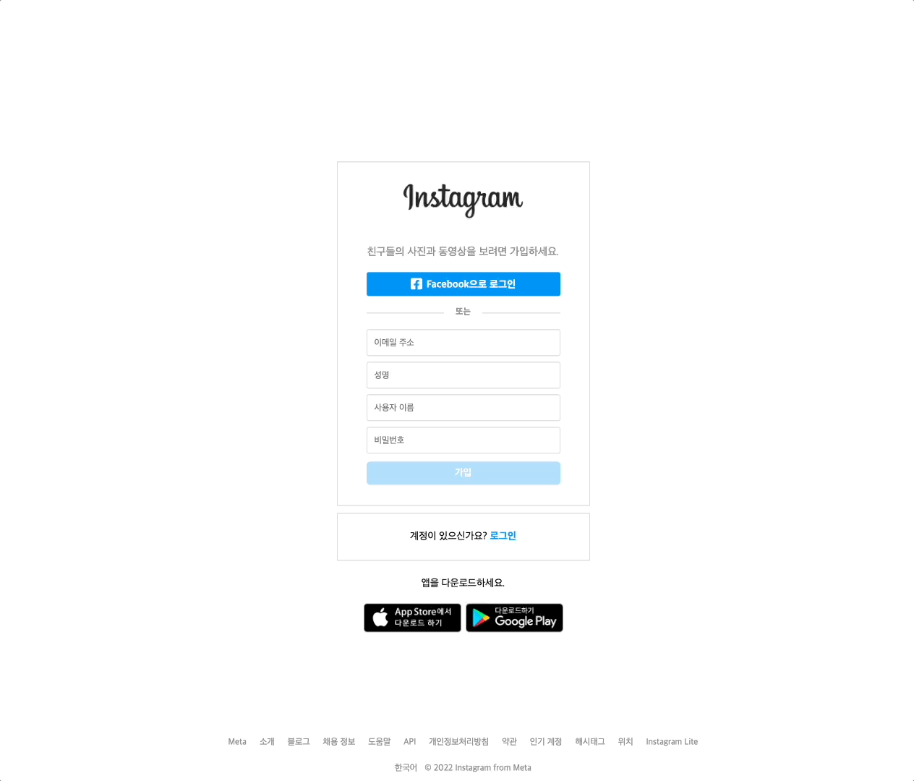

> 2. 프로필

- 프로필 페이지에서 유저 정보, 사진, 팔로워, 팔로우를 확인할 수 있습니다.
- 팔로워는 해당 유저를 팔로우하고 있는 유저들의 목록이고, 팔로우는 해당 유저가 팔로우하고 있는 유저들의 목록입니다.
    
  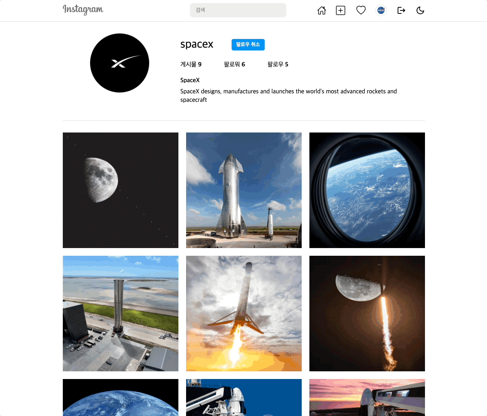

> 3. 유저 팔로우, 언팔로우

- 유저를 팔로우하거나 언팔로우할 수 있습니다.
- 팔로우하거나 팔로우를 취소하게 되면, `Apollo Client`를 통해 상대방과 자신의 캐시된 필드 값을 직접 수정하여 팔로워와 팔로우 목록을 업데이트합니다.
- 유저를 팔로우하게 되면, 홈에서 해당 유저가 업로드한 사진들을 볼 수 있습니다.
    
  

> 4. 유저 및 해시태그 검색

- **@유저이름** 으로 유저를 검색할 수 있습니다. (ex: @nasa)
- **#해시태그** 로 해시태그를 검색할 수 있습니다. (ex: #space)
- `React Hook Form`을 이용해 **@이름** 을 입력 시 유저를, **#해시태그**를 입력 시 해시태그를 검색합니다.
    
  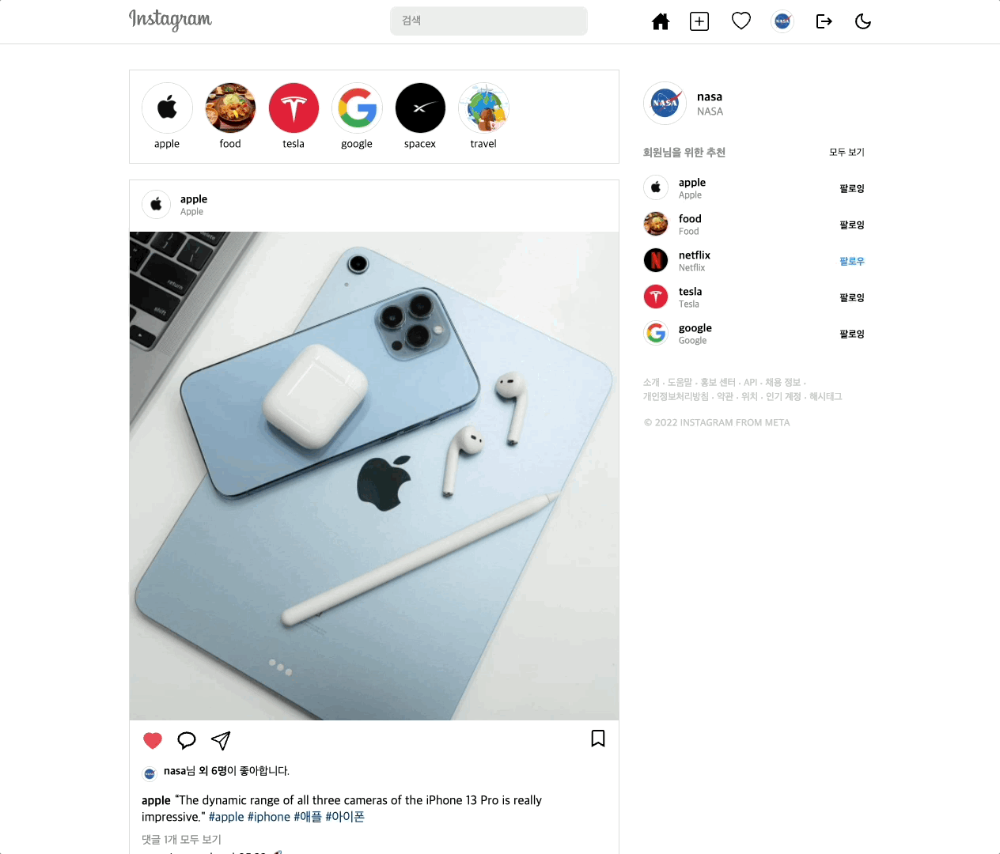

> 5. 사진

- 사진을 클릭하여 사진 상세정보를 확인할 수 있습니다.
- `Framer Motion`을 이용해 모달 창이 나타나거나 사라질 때, 애니메이션을 적용하였습니다.
- 사진을 업로드한 유저, 캡션, 댓글, 좋아요 등을 확인할 수 있습니다.
- 사진에 좋아요를 누른 유저들을 확인할 수 있고, 해당 유저들을 팔로우하거나 언팔로우할 수 있습니다.
- 사진에 댓글을 작성하거나 수정 및 삭제할 수 있습니다.
- 사진을 업로드한 유저는 사진의 캡션을 수정하거나 사진을 삭제할 수 있습니다.
    
  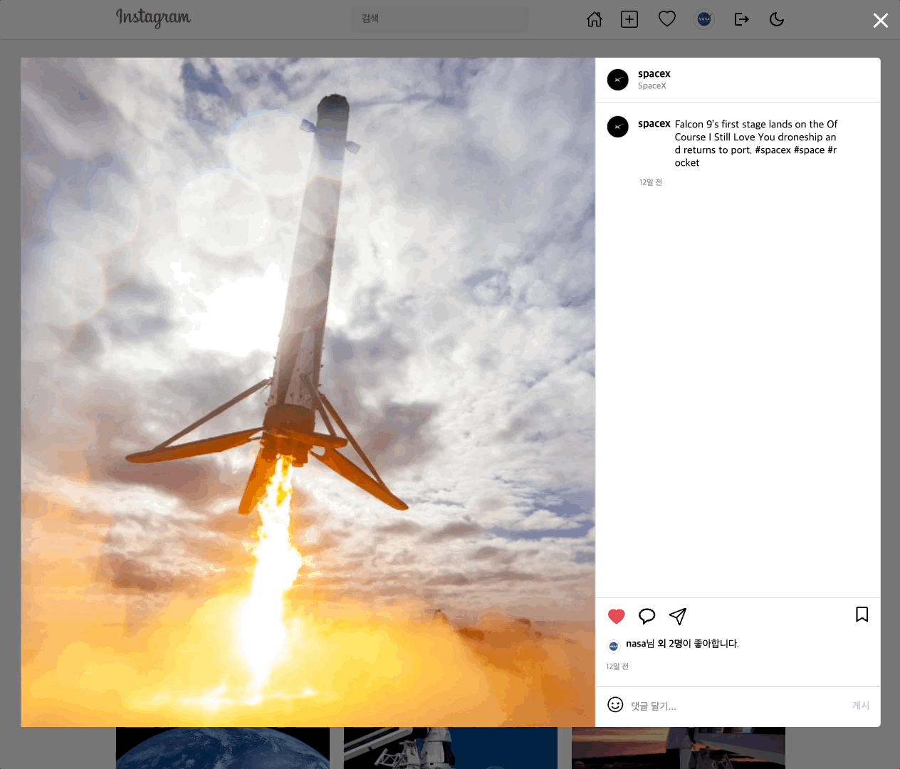

> 6. 사진 업로드

- 사진 이미지와 캡션을 입력해 사진을 업로드할 수 있습니다.
- 캡션에는 **@유저이름** 또는 **#해시태그** 를 입력해, 유저 이름 또는 해시태그를 작성할 수 있습니다.
- 업로드한 사진은 `AWS S3`의 버킷에 저장됩니다.
    
  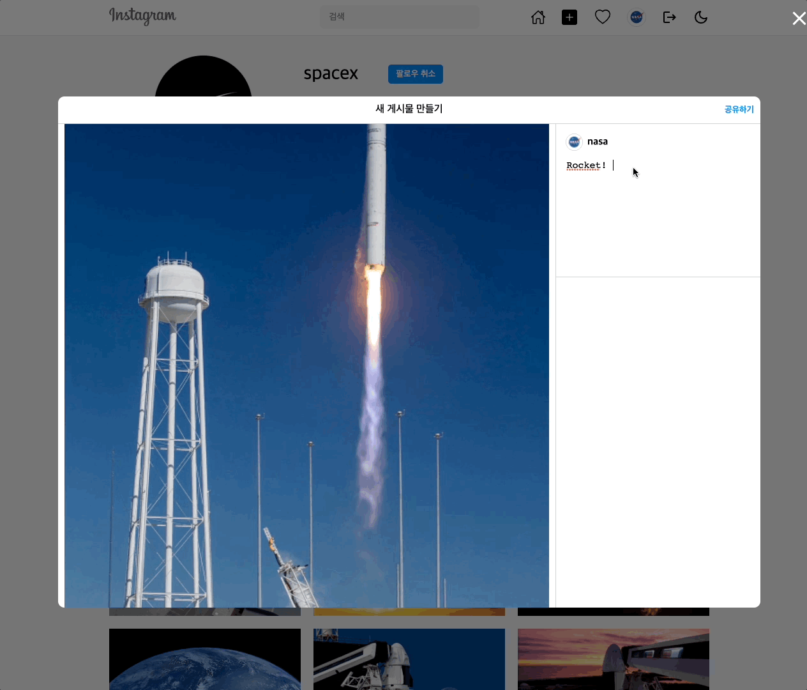

> 7. 사진 좋아요, 좋아요 취소

- 사진에 좋아요를 누르거나 좋아요를 취소할 수 있습니다.
- 좋아요 또는 좋아요 취소를 하게 되면, `Apollo Client`를 통해 해당 사진의 캐시된 필드 값을 직접 수정하여 좋아요와 전체 좋아요 수를 업데이트합니다.
    
  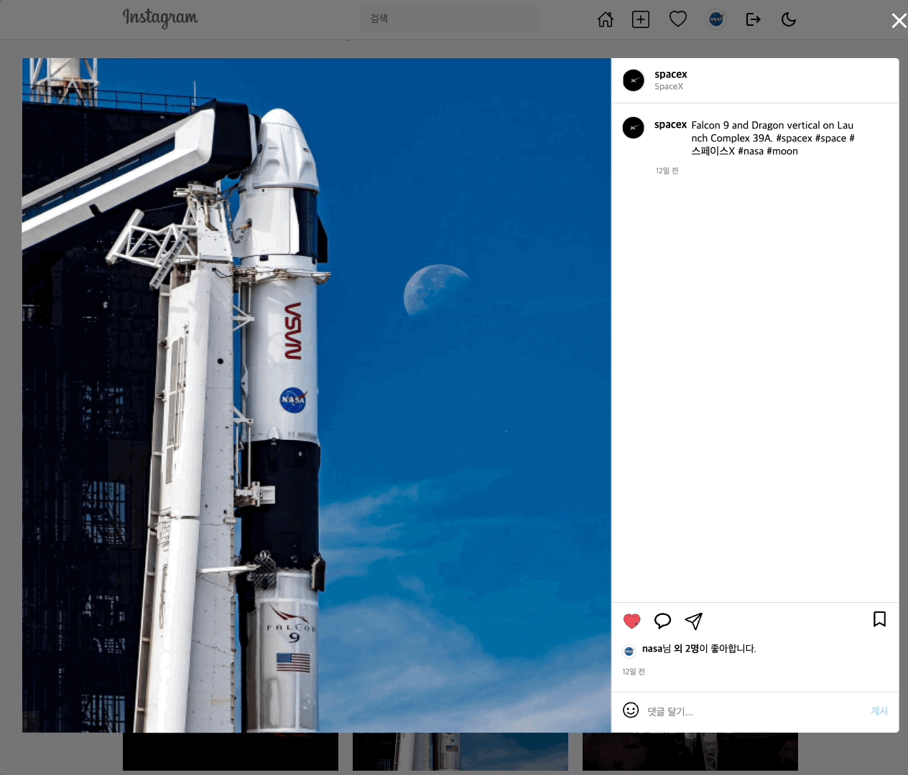

> 8. 해시태그

- 해시태그는 해당 해시태그가 가지고 있는 전체 사진들을 불러옵니다.
- 사진 업로드 시, 캡션에 **#해시태그** 를 입력하게 되면, 새로운 해시태그가 생성됩니다.
    
  

> 9. 팔로우 업데이트

- `GraphQL Subscriptions`를 통해 상대방이 자신을 팔로우하게 되면, 실시간으로 팔로우 업데이트 알림을 받을 수 있습니다.
- `PubSub`을 이용해 팔로우 시, 이벤트를 publish하게 되고, 해당 이벤트를 listen하고 있는 유저는 팔로우 업데이트 알림을 받게 됩니다.
    
  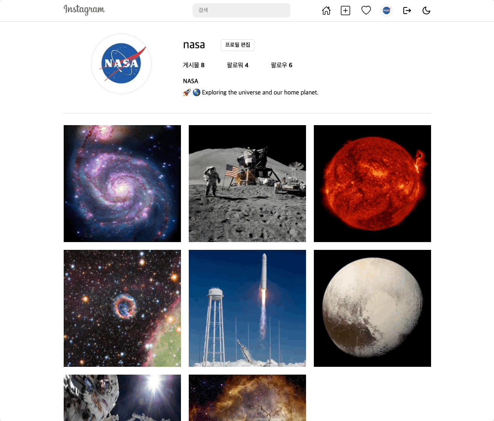

> 10. 다크모드

- 해와 달을 클릭해 라이트 모드와 다크 모드를 전환할 수 있습니다.
- `Styled Components`의 `ThemeProvider`를 이용해 라이트 테마와 다크 테마를 설정합니다.
- 다크 모드 전환 시, 다크 모드 활성 여부를 로컬 스토리지에 저장하고, `Apollo Client`의 `Reactive variables`를 이용해서 local state를 업데이트합니다.
    
  

> 11. 회원가입, 로그인, 로그아웃 (앱)

- 유저는 이메일, 성명, 사용자 이름, 비밀번호를 입력해 회원가입을 할 수 있습니다.
- 유저는 사용자 이름, 비밀번호를 입력해 로그인할 수 있습니다.
- 성공적으로 로그인 시, `JsonWebToken`을 받게 되고 해당 토큰을 `AsyncStorage`에 저장합니다.
- 앱 로딩 시, `AsyncStorage`로부터 토큰을 가져와 로그인 여부를 확인합니다.
- 로그아웃 시, `Reactive variables`를 변경하고, `AsyncStorage`에 저장된 토큰과 스토어에 저장된 데이터를 제거합니다.
    
  
  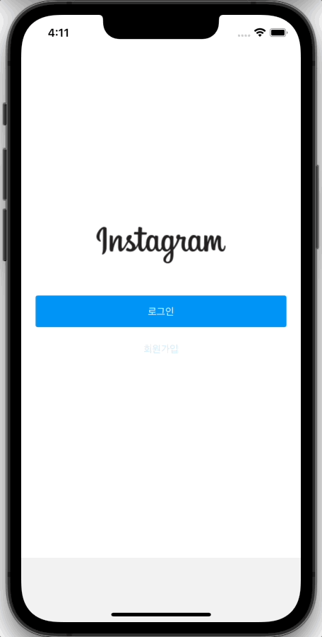

> 12. 프로필 (앱)

- 프로필 페이지에서 유저 정보, 사진, 팔로워, 팔로우를 확인할 수 있습니다.
- 사진을 클릭하여 사진 상세정보를 확인할 수 있습니다.
- 사진을 업로드한 유저, 캡션, 댓글, 좋아요 등을 확인할 수 있습니다.
    
  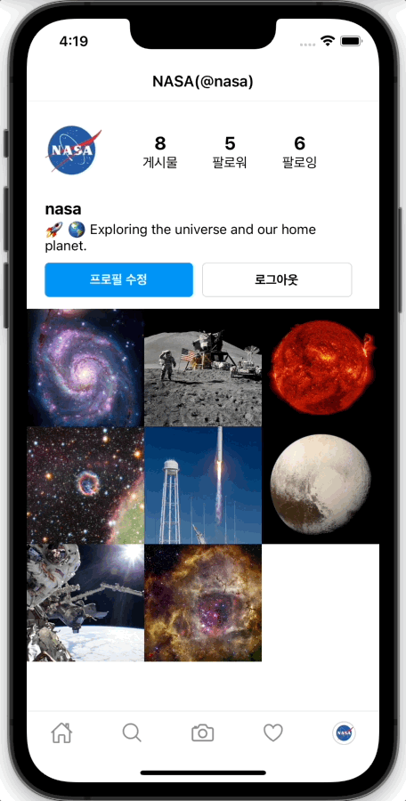
  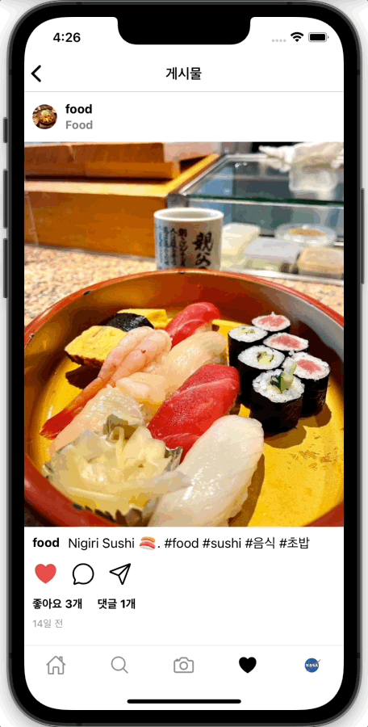

> 14. 사진 검색, 사진 선택 및 사진 촬영 (앱)

- **캡션** 으로 사진을 검색할 수 있습니다. (ex: food)
- 유저는 휴대폰 앨범에 있는 사진들을 선택하거나, 사진 촬영을 통해 촬영한 사진을 업로드할 수 있습니다.
- `expo-media-library`를 통해 미디어 라이브러리에 대한 접근 권한을 설정합니다.
- `expo-camera`를 통해 카메라의 type, zoom, ratio, whiteBalance등을 설정합니다.
    
  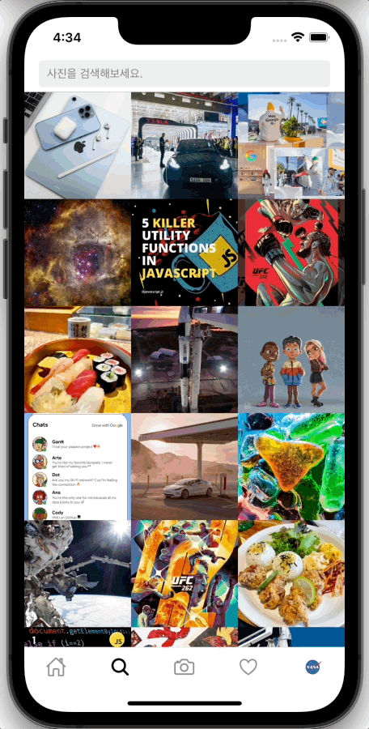
  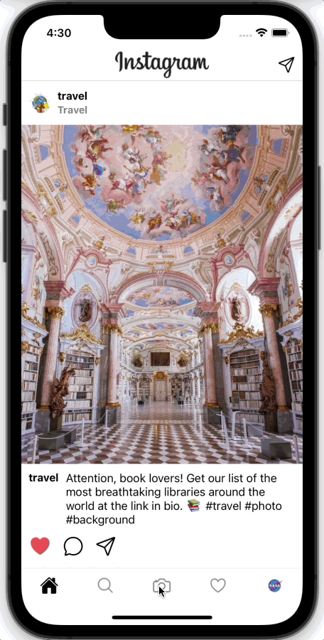

> 15. 기타

- `Front-end`는 `Netlify`에, `Back-end`는 `Heroku`에 배포하였습니다.
- `Database`는 `Heroku PostgreSQL`에 배포하였습니다.
- `GraphQL Code Generator`를 이용해 `GraphQL Schema`로부터 타입 및 코드를 생성하였습니다.
- `Front-end`: https://github.com/GitHubGW/instagram-frontend
- `Back-end`: https://github.com/GitHubGW/instagram-backend
- `App`: https://github.com/GitHubGW/instagram-app

## Pages

> Root

- 홈
- 로그인
- 회원가입

> User

- 전체 유저
- 유저 프로필
- 유저 팔로우
- 유저 팔로워
- 프로필 수정

> Photo

- 사진 업로드
- 사진 상세정보

> Hashtag

- 해시태그

## Features

### 🙎‍♂️ User

- [x] 회원가입, 회원탈퇴
- [x] 로그인, 로그아웃
- [x] 프로필 보기
- [x] 팔로우, 언팔로우
- [x] 팔로워, 팔로우 보기
- [x] 유저 검색
- [x] 프로필 수정
- [x] 전체 유저 보기
- [x] 팔로우 업데이트

### 📷 Photo

- [x] 사진 보기
- [x] 사진 좋아요 보기
- [x] 사진 업로드
- [x] 사진 수정
- [x] 사진 삭제
- [x] 사진 검색
- [x] 피드 보기

### 💬 Comment

- [x] 댓글 보기
- [x] 댓글 생성
- [x] 댓글 수정
- [x] 댓글 삭제
- [x] 댓글 업데이트

### #️⃣ Hashtag

- [x] 해시태그 보기
- [x] 해시태그 검색

### ❤️ Like

- [x] 사진 좋아요, 좋아요 취소
- [x] 좋아요 업데이트

### 📨 Room

- [x] 전체 채팅방 보기
- [x] 채팅방 보기

### ✉️ Message

- [x] 메세지 보내기
- [x] 메세지 읽기
- [x] 메세지 삭제
- [x] 메세지 업데이트

## License

MIT
